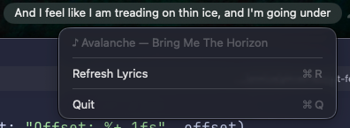

# Spotify Lyrics Menu Bar

A tiny native macOS menu bar app that shows time-synced lyrics for the song currently playing in the Spotify desktop app.

This Swift/AppKit version packages the same idea as a native macOS `.app` for people who prefer a drag-and-drop install.

Inspired by Nadia Lovely's original Python project: https://github.com/nadialvy/spotify-lyrics-menubar



## Requirements

- macOS
- Spotify desktop app

## Install

1. Download `SpotifyLyricsMenuBar.dmg` from the [latest GitHub Release](https://github.com/mifwar/spotify-lyrics-menubar-swift/releases).
2. Open the DMG.
3. Drag `SpotifyLyricsMenuBar.app` to Applications.
4. Right-click `SpotifyLyricsMenuBar.app` in Applications and choose Open.
5. Confirm Open when macOS asks.

On first launch, macOS may ask for Automation permission so the app can read the current Spotify track and playback position.

If macOS still blocks the app, open System Settings > Privacy & Security, then choose Open Anyway for SpotifyLyricsMenuBar.

Note: release builds are not notarized yet, so macOS may show an "unidentified developer" warning after download.

Use the menu bar app menu to move lyric timing earlier or later in 0.5 second steps. The offset is saved automatically.

## Development

Build the app locally:

```bash
make app
```

Run the local build:

```bash
make run
```

Build a local DMG:

```bash
make dmg
```

The GitHub Actions release workflow builds and uploads `SpotifyLyricsMenuBar.dmg` automatically when you push a version tag like `v1.0.0`.

## How It Works

- Reads the current track, artist, and playback position from Spotify via AppleScript.
- Fetches synced lyrics from lrclib.net.
- Falls back to plain lyrics with estimated timing when synced lyrics are unavailable.
- Updates the menu bar title as the song progresses.
